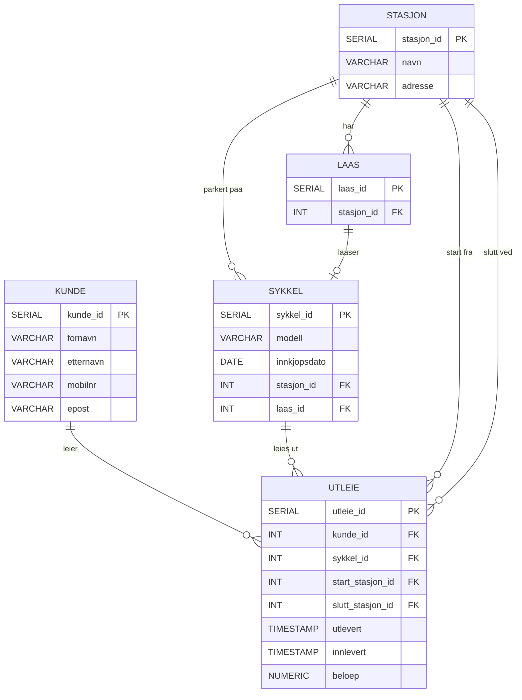

# Besvarelse - Refleksjon og Analyse

**Student:** sakariya abshir

**Dato:** 01.014.2026

---

## Del 1: Datamodellering

### Oppgave 1.1: Entiteter og attributter

**Identifiserte entiteter:**

Ut fra case-beskrivelsen identifiseres fem entiteter:

1. **Stasjon** — representerer en fysisk sykkelstasjon der sykler kan hentes og leveres.
2. **Lås** — representerer en enkelt låseplass på en stasjon. En stasjon har mange låser.
3. **Sykkel** — representerer en individuell bysykkel som kan leies ut.
4. **Kunde** — en registrert bruker av bysykkelsystemet.
5. **Utleie** — representerer én utleietransaksjon mellom kunde og sykkel.

Lås er modellert som egen entitet fordi casen spesifiserer at en sykkel låses fast i en lås på en stasjon, og at en stasjon har mange låser. Det gir mulighet til å spore hvilken lås en sykkel er festet til.

**Attributter for hver entitet:**

**Stasjon:** stasjon_id, navn, adresse

**Lås:** laas_id, stasjon_id (tilhørende stasjon)

**Sykkel:** sykkel_id, modell, innkjopsdato, stasjon_id (nåværende stasjon, NULL ved utleie), laas_id (nåværende lås, NULL ved utleie)

**Kunde:** kunde_id, fornavn, etternavn, mobilnr, epost

**Utleie:** utleie_id, kunde_id, sykkel_id, start_stasjon_id, slutt_stasjon_id (NULL hvis ikke levert), utlevert, innlevert (NULL hvis ikke levert), beloep (NULL inntil levering)

---

### Oppgave 1.2: Datatyper og `CHECK`-constraints

**Valgte datatyper og begrunnelser:**

| Attributt | Datatype | Begrunnelse |
|---|---|---|
| stasjon_id, laas_id, sykkel_id, kunde_id, utleie_id | SERIAL | Autoinkrementerende heltall — enkel surrogatnøkkel |
| navn | VARCHAR(100) | Stasjonsnavn trenger fleksibel lengde |
| adresse | VARCHAR(200) | Adresser kan være relativt lange |
| modell | VARCHAR(100) | Sykkelmodellnavn |
| innkjopsdato | DATE | Kun dato, ikke tidspunkt |
| fornavn, etternavn | VARCHAR(50) | Tilstrekkelig for personnavn |
| mobilnr | VARCHAR(15) | Lagres med landskode (+47), variabel lengde |
| epost | VARCHAR(100) | Standard lengde for e-postadresser |
| utlevert, innlevert | TIMESTAMP | Tidspunkt med dato og klokkeslett |
| beloep | NUMERIC(8,2) | Presist desimaltall for pengebeløp |
| fremmednøkler (stasjon_id, laas_id, etc.) | INT | Matcher SERIAL-nøklene de refererer til |

**`CHECK`-constraints:**

- `chk_mobilnr`: Sikrer at mobilnummeret matcher norsk format `+47` etterfulgt av 8 siffer. Regex: `^\+47[0-9]{8}$`. Forhindrer feil under registrering.
- `chk_epost`: Sjekker at e-postadressen inneholder `@` med tekst før og etter, samt et domene med punktum. Regex: `^[^@]+@[^@]+\.[^@]+$`. Grunnleggende formatvalidering.
- `chk_beloep`: Sikrer at beløpet er NULL (ikke avsluttet utleie) eller >= 0. Negativt beløp gir ingen mening.
- `chk_tider`: Sikrer at innleveringstidspunktet er etter utleveringstidspunktet, eller NULL (utleie pågår).

**ER-diagram:**



---

### Oppgave 1.3: Primærnøkler

**Valgte primærnøkler og begrunnelser:**

| Entitet | Primærnøkkel | Type |
|---|---|---|
| Stasjon | stasjon_id | Surrogat (SERIAL) |
| Lås | laas_id | Surrogat (SERIAL) |
| Sykkel | sykkel_id | Surrogat (SERIAL) |
| Kunde | kunde_id | Surrogat (SERIAL) |
| Utleie | utleie_id | Surrogat (SERIAL) |

**Naturlige vs. surrogatnøkler:**

Surrogatnøkler (SERIAL) er valgt for alle entiteter. Begrunnelsen er:

- **Kunde** har potensielle kandidatnøkler i mobilnr og epost (begge UNIQUE), men disse kan endres over tid. En surrogatnøkkel er stabil.
- **Sykkel** har en unik ID nevnt i casen, men SERIAL gjør det enklere å generere og referere til.
- **Stasjon** og **Lås** har ingen naturlige kandidatnøkler — de identifiseres kun av systemet.
- **Utleie** er en hendelse uten naturlig nøkkel. En kombinasjon av (kunde_id, sykkel_id, utlevert) ville vært mulig, men er tungvint som fremmednøkkel.

Surrogatnøkler gir enklere JOINs, stabile referanser, og er standard praksis i databasedesign.

**Oppdatert ER-diagram:** Se diagram over — PK er markert.

---

### Oppgave 1.4: Forhold og fremmednøkler

**Identifiserte forhold og kardinalitet:**

| Forhold | Kardinalitet | Forklaring |
|---|---|---|
| Stasjon → Lås | 1:N | En stasjon har mange låser. En lås tilhører én stasjon. |
| Stasjon → Sykkel | 1:N (valgfri) | En sykkel kan stå på én stasjon, eller NULL ved utleie. |
| Lås → Sykkel | 1:1 (valgfri) | En sykkel er festet til maks én lås. Én lås holder maks én sykkel. |
| Kunde → Utleie | 1:N | En kunde kan ha mange utleier. En utleie tilhører én kunde. |
| Sykkel → Utleie | 1:N | En sykkel kan leies ut mange ganger. |
| Stasjon → Utleie (start) | 1:N | Utleie starter fra én stasjon. |
| Stasjon → Utleie (slutt) | 1:N (valgfri) | Utleie ender på én stasjon, eller NULL hvis pågående. |

**Fremmednøkler:**

- `laas.stasjon_id` → `stasjon.stasjon_id` (NOT NULL)
- `sykkel.stasjon_id` → `stasjon.stasjon_id` (nullable)
- `sykkel.laas_id` → `laas.laas_id` (nullable, UNIQUE — én sykkel per lås)
- `utleie.kunde_id` → `kunde.kunde_id` (NOT NULL)
- `utleie.sykkel_id` → `sykkel.sykkel_id` (NOT NULL)
- `utleie.start_stasjon_id` → `stasjon.stasjon_id` (NOT NULL)
- `utleie.slutt_stasjon_id` → `stasjon.stasjon_id` (nullable)

**Oppdatert ER-diagram:** Se diagram i oppgave 1.2 — inkluderer FK-relasjoner.

---

### Oppgave 1.5: Normalisering

**Vurdering av 1. normalform (1NF):**

Modellen tilfredsstiller 1NF fordi alle attributter inneholder atomære verdier. Det finnes ingen flerverdige attributter eller repeterende grupper. For eksempel lagres fornavn og etternavn i separate kolonner, ikke som én sammenslått streng. Hver rad har en unik primærnøkkel.

**Vurdering av 2. normalform (2NF):**

Modellen tilfredsstiller 2NF. Alle tabeller har enkle primærnøkler (SERIAL), ikke sammensatte. Dermed kan det ikke oppstå partielle avhengigheter — alle ikke-nøkkel-attributter er fullt funksjonelt avhengige av hele primærnøkkelen. For eksempel: i utleie-tabellen avhenger alle attributter (kunde_id, sykkel_id, utlevert, etc.) av utleie_id alene.

**Vurdering av 3. normalform (3NF):**

Modellen tilfredsstiller 3NF. Det finnes ingen transitive avhengigheter. Ingen ikke-nøkkel-attributt avhenger av en annen ikke-nøkkel-attributt. For eksempel: kundens navn og e-post er lagret i kunde-tabellen og avhenger kun av kunde_id, ikke av hverandre. Stasjonsnavn og adresse er i stasjon-tabellen og avhenger kun av stasjon_id.

**Eventuelle justeringer:**

Ingen justeringer var nødvendige. Modellen ble designet med normalisering i tankene fra starten. Separasjonen av stasjon, lås, sykkel, kunde og utleie i egne tabeller eliminerer redundans og sikrer at hver fakta lagres nøyaktig ett sted.

---

## Del 2: Database-implementering

### Oppgave 2.1: SQL-skript for database-initialisering

**Plassering av SQL-skript:**

SQL-skriptet ligger i `init-scripts/01-init-database.sql`.

**Antall testdata:**

- Kunder: 7
- Sykler: 100
- Sykkelstasjoner: 5
- Låser: 100 (20 per stasjon)
- Utleier: 55 (50 fullførte + 5 pågående)

---

### Oppgave 2.2: Kjøre initialiseringsskriptet

**Dokumentasjon av vellykket kjøring:**

Databasen startes med:
```bash
docker-compose up -d
```

Verifisering av vellykket initialisering:
```bash
docker-compose logs postgres | grep "Database initialisert"
```

**Spørring mot systemkatalogen:**

```sql
SELECT table_name
FROM information_schema.tables
WHERE table_schema = 'public'
  AND table_type = 'BASE TABLE'
ORDER BY table_name;
```

**Resultat:**

```
 table_name
------------
 kunde
 laas
 stasjon
 sykkel
 utleie
(5 rows)
```

---

## Del 3: Tilgangskontroll

### Oppgave 3.1: Roller og brukere

**SQL for å opprette rolle:**

```sql
CREATE ROLE kunde;
```

**SQL for å opprette bruker:**

```sql
CREATE USER kunde_1 WITH PASSWORD 'kunde123';
GRANT kunde TO kunde_1;
```

**SQL for å tildele rettigheter:**

```sql
GRANT SELECT ON stasjon, sykkel, laas, kunde, utleie TO kunde;
```

Kunde-rollen får kun lesetilgang (SELECT) på tabellene. Ingen INSERT, UPDATE eller DELETE. Dette hindrer kunder i å endre data direkte.

---

### Oppgave 3.2: Begrenset visning for kunder

**SQL for VIEW:**

```sql
CREATE VIEW kunde_1_utleier AS
SELECT u.utleie_id, u.sykkel_id,
       s1.navn AS start_stasjon,
       s2.navn AS slutt_stasjon,
       u.utlevert, u.innlevert, u.beloep
FROM utleie u
JOIN stasjon s1 ON u.start_stasjon_id = s1.stasjon_id
LEFT JOIN stasjon s2 ON u.slutt_stasjon_id = s2.stasjon_id
WHERE u.kunde_id = 1;

GRANT SELECT ON kunde_1_utleier TO kunde_1;
```

**Ulempe med VIEW vs. POLICY:**

Et VIEW med hardkodet `WHERE kunde_id = 1` gjelder kun for én spesifikk kunde. For N kunder trenger man N separate VIEWs, noe som skalerer dårlig. Med Row Level Security (RLS / POLICY) kan PostgreSQL dynamisk filtrere rader basert på `current_user` i én enkelt definisjon. POLICY fungerer transparent: kunden kan gjøre `SELECT * FROM utleie` og ser automatisk kun egne rader, uten å vite om et eget VIEW. VIEWs gir ingen slik dynamisk filtrering — de er statiske definisjoner.

---

## Del 4: Analyse og Refleksjon

### Oppgave 4.1: Lagringskapasitet

**Totalt antall utleier per år:**

- Høysesong (mai–sept): 5 måneder × 20 000 = 100 000
- Mellomsesong (mar, apr, okt, nov): 4 måneder × 5 000 = 20 000
- Lavsesong (des–feb): 3 måneder × 500 = 1 500
- **Totalt: 121 500 utleier/år**

**Estimat for lagringskapasitet:**

Beregning basert på PostgreSQL sin interne lagring. Hver rad har ca. 23 byte header (HeapTupleHeader).

**Stasjon-tabellen** (5 rader):
- stasjon_id (INT): 4 byte
- navn (VARCHAR ~20 tegn): ~21 byte
- adresse (VARCHAR ~30 tegn): ~31 byte
- Rad-header: 23 byte
- Per rad: ~79 byte → 5 × 79 ≈ **400 byte**

**Lås-tabellen** (100 rader):
- laas_id (INT): 4 byte
- stasjon_id (INT): 4 byte
- Header: 23 byte
- Per rad: ~31 byte → 100 × 31 ≈ **3 100 byte ≈ 3 KB**

**Sykkel-tabellen** (100 rader):
- sykkel_id (INT): 4, modell (VARCHAR ~15): ~16, innkjopsdato (DATE): 4, stasjon_id (INT): 4, laas_id (INT): 4, header: 23
- Per rad: ~55 byte → 100 × 55 ≈ **5 500 byte ≈ 5,5 KB**

**Kunde-tabellen** (vokser sakte, anta ~10 000 kunder etter ett år):
- kunde_id: 4, fornavn (~10): 11, etternavn (~10): 11, mobilnr (12): 13, epost (~25): 26, header: 23
- Per rad: ~88 byte → 10 000 × 88 ≈ **880 KB ≈ 0,9 MB**

**Utleie-tabellen** (121 500 rader — dominerer lagringen):
- utleie_id: 4, kunde_id: 4, sykkel_id: 4, start_stasjon_id: 4, slutt_stasjon_id: 4, utlevert (TIMESTAMP): 8, innlevert (TIMESTAMP): 8, beloep (NUMERIC): 8, header: 23
- Per rad: ~67 byte → 121 500 × 67 ≈ **8,1 MB**

**Totalt for første år:**

Tabelldata: ~0,4 KB + 3 KB + 5,5 KB + 880 KB + 8 140 KB ≈ **9 MB**

Med indekser (primærnøkler, UNIQUE-constraints) legges det til anslagsvis 30–50% ekstra: **~12–14 MB totalt**.

Utleie-tabellen dominerer lagringen og vokser lineært med antall utleier.

---

### Oppgave 4.2: Flat fil vs. relasjonsdatabase

**Analyse av CSV-filen (`data/utleier.csv`):**

**Problem 1: Redundans**

I CSV-filen gjentas kundeinformasjon for hver utleie. Ole Hansen (mobilnr +4791234567, epost ole.hansen@example.com) forekommer i rad 1, 2 og 7 med identisk kontaktinformasjon. Tilsvarende gjentas stasjonsinformasjon: «Grünerløkka Stasjon, Thorvald Meyers gate 10 Oslo» forekommer i rad 3, 4, 7 og 9. Sykkeldata som «City Bike Pro, 2023-03-15» gjentas i rad 1, 4, 6 og 9. I en relasjonsdatabase lagres hver kunde, stasjon og sykkel kun én gang i sin egen tabell.

**Problem 2: Inkonsistens**

Redundans åpner for inkonsistens. Hvis Ole Hansens telefonnummer endres, må det oppdateres i alle rader der han forekommer. Glemmer man én rad, har databasen motstridende informasjon om samme kunde. I en relasjonsdatabase oppdateres mobilnummeret i kun én rad i kunde-tabellen.

**Problem 3: Oppdateringsanomalier**

- **Sletteanomali:** Hvis man sletter Annas eneste utleie (rad 10), mister man all informasjon om at Anna er registrert som kunde.
- **Innsettingsanomali:** Man kan ikke registrere en ny stasjon uten å samtidig opprette en utleie, fordi all informasjon er samlet i én flat rad.
- **Oppdateringsanomali:** Endring av stasjonsadresse krever oppdatering av alle rader som refererer til den stasjonen — risiko for inkonsistens.

**Fordeler med en indeks:**

Uten indeks må databasen gjøre en sekvensiell skanning (full table scan) gjennom alle rader for å finne utleier for en gitt sykkel — O(n) for n rader.

**Case 1: Indeks passer i RAM**

En B+-tre-indeks på sykkel_id (eller sykkel-kolonnen i CSV) sorterer verdiene i en trestruktur. Oppslag skjer i O(log n) tid. Med 121 500 rader betyr det ca. 17 sammenligninger i stedet for 121 500. Når hele indeksen ligger i RAM, unngår man diskoperasjoner og oppslaget er svært raskt.

**Case 2: Indeks passer ikke i RAM**

Når datasettet er for stort for minnet, kan man bruke ekstern sortering (flettesortering / merge sort). Dataen deles i biter som passer i RAM, hver bit sorteres, og bitene flettes sammen. Resultatet er en sortert fil der oppslag kan gjøres med binærsøk. PostgreSQL håndterer dette automatisk, men kostnadene er høyere pga. disk I/O.

**Datastrukturer i DBMS:**

PostgreSQL bruker primært B+-trær for sine indekser. Et B+-tre er balansert, gir O(log n) oppslag, og støtter effektive range-spørringer fordi bladnodene er lenket. Hash-indekser gir O(1) for eksakte oppslag (equality), men støtter ikke range-spørringer og brukes sjeldnere. For sykkel_id-oppslag (eksakt match) ville en hash-indeks fungert, men B+-treet er mer fleksibelt.

---

### Oppgave 4.3: Datastrukturer for logging

**Foreslått datastruktur:** LSM-tree (Log-Structured Merge-tree)

**Begrunnelse:**

**Skrive-operasjoner:**

Logging er append-only — nye hendelser skrives sekvensielt uten å endre eksisterende data. En LSM-tree optimaliserer for dette ved å først skrive til en buffer i minnet (memtable). Når bufferen er full, flushes den til disk som en sortert fil (SSTable). Sekvensielle diskskrivinger er mye raskere enn tilfeldige oppdateringer i et B+-tre, der innsetting kan kreve ombalansering. For et system med tusenvis av hendelser per sekund (innlogginger, innsettinger, oppdateringer) er dette avgjørende.

**Lese-operasjoner:**

Logging leses sjeldnere enn det skrives — typisk kun ved feilsøking eller revisjon. LSM-trær komprimerer SSTables i bakgrunnen (compaction), noe som gradvis forbedrer leseytelsen. Et Bloom-filter kan avgjøre raskt om en nøkkel finnes i en gitt SSTable, og reduserer unødvendige diskoppslag. Leseytelsen er noe dårligere enn et B+-tre, men dette er akseptabelt for en logg der skriveytelse prioriteres.

En enkel heap-fil (append-only) ville også fungert, men uten indeksering blir oppslag svært trege for store loggfiler.

---

### Oppgave 4.4: Validering i flerlags-systemer

**Hvor bør validering gjøres:**

Validering bør gjøres i alle tre lag — nettleser, applikasjonslag og database — med ulike roller.

**Validering i nettleseren:**

Fordel: Gir umiddelbar tilbakemelding til brukeren uten å vente på serverrespons. For eksempel kan man sjekke at mobilnummeret har riktig format før skjemaet sendes. Ulempe: Klientsidevalidering kan omgås — en bruker kan deaktivere JavaScript eller sende forespørsler direkte til API-et. Derfor kan man aldri stole på nettleseren alene.

**Validering i applikasjonslaget:**

Fordel: Her implementeres forretningslogikk, som at en kunde ikke kan leie mer enn X sykler samtidig, eller at e-posten ikke allerede er registrert. Applikasjonslaget kan gi detaljerte feilmeldinger og logge valideringsfeil. Ulempe: Hvis flere applikasjoner (web, mobil, API) bruker samme database, må valideringslogikken dupliseres i hvert applikasjonslag.

**Validering i databasen:**

Fordel: Databasen er siste forsvarslinje. CHECK-constraints, NOT NULL, UNIQUE og fremmednøkler sikrer at ugyldige data aldri lagres, uavhengig av hvilken applikasjon som skriver til databasen. Ulempe: Feilmeldinger fra databasen er tekniske og vanskelige å presentere til brukeren. Databasevalidering alene gir dårlig brukeropplevelse.

**Konklusjon:**

Validering bør gjøres i alle lag (defence in depth): nettleseren for brukeropplevelse, applikasjonslaget for forretningsregler, og databasen som siste garanti for dataintegritet. Denne tilnærmingen beskytter mot feil uansett hvor de oppstår.

---

### Oppgave 4.5: Refleksjon over læringsutbytte

> **Denne seksjonen må du skrive selv — den skal være personlig.**
>
> Tips basert på læringsmålene fra PDF-en:
> - **KM1/KM6:** Forklar hva du har lært om hva et databasesystem er og hvordan ER-modellering og normalisering gir god struktur.
> - **FM1:** Reflekter over prosessen med å designe ER-diagrammet.
> - **FM2/FM3:** Hva lærte du om å opprette tabeller, brukere og rettigheter med SQL?
> - **FM4:** Hvordan gikk det å skrive SELECT-spørringene?
> - **GKM1:** Hva har du lært om å dokumentere databasedesign?
> - Hva var mest utfordrende? Hva ville du gjort annerledes?

---

## Del 5: SQL-spørringer og Automatisk Testing

**Plassering av SQL-spørringer:**

Alle spørringene ligger i `test-scripts/queries.sql`.

**Eventuelle feil og rettelser:**

Ingen feil ved kjøring av spørringene mot den initialiserte databasen.

---

## Del 6: Bonusoppgaver (Valgfri)

### Oppgave 6.1: Trigger for lagerbeholdning

**SQL for trigger:**

Triggeren kan legges til i `init-scripts/01-init-database.sql`:

```sql
-- Lagerbeholdningstabell
CREATE TABLE lagerbeholdning (
    stasjon_id INT PRIMARY KEY REFERENCES stasjon(stasjon_id),
    antall_tilgjengelige INT NOT NULL DEFAULT 0
);

-- Initialiser lagerbeholdning
INSERT INTO lagerbeholdning (stasjon_id, antall_tilgjengelige)
SELECT s.stasjon_id, COUNT(sy.sykkel_id)
FROM stasjon s
LEFT JOIN sykkel sy ON s.stasjon_id = sy.stasjon_id
GROUP BY s.stasjon_id;

-- Triggerfunksjon
CREATE OR REPLACE FUNCTION oppdater_lagerbeholdning()
RETURNS TRIGGER AS $$
BEGIN
    -- Ved utleie: sykkel fjernes fra stasjon (stasjon_id settes til NULL)
    IF OLD.stasjon_id IS NOT NULL AND NEW.stasjon_id IS NULL THEN
        UPDATE lagerbeholdning
        SET antall_tilgjengelige = antall_tilgjengelige - 1
        WHERE stasjon_id = OLD.stasjon_id;
    END IF;

    -- Ved innlevering: sykkel plasseres på stasjon (stasjon_id settes fra NULL)
    IF OLD.stasjon_id IS NULL AND NEW.stasjon_id IS NOT NULL THEN
        UPDATE lagerbeholdning
        SET antall_tilgjengelige = antall_tilgjengelige + 1
        WHERE stasjon_id = NEW.stasjon_id;
    END IF;

    RETURN NEW;
END;
$$ LANGUAGE plpgsql;

-- Koble trigger til sykkel-tabellen
CREATE TRIGGER trg_lagerbeholdning
AFTER UPDATE OF stasjon_id ON sykkel
FOR EACH ROW
EXECUTE FUNCTION oppdater_lagerbeholdning();
```

**Forklaring:**

Triggeren lytter på endringer i `sykkel.stasjon_id`. Når en sykkel leies ut (stasjon_id går fra en verdi til NULL), trekkes 1 fra lagerbeholdningen for den stasjonen. Når en sykkel leveres tilbake (stasjon_id går fra NULL til en verdi), legges 1 til for den nye stasjonen. Lagerbeholdning-tabellen gir sanntidsoversikt uten å måtte telle sykler med en spørring hver gang.

**Testing:**

```sql
-- Sjekk lagerbeholdning før
SELECT * FROM lagerbeholdning;

-- Simuler utleie: sykkel 1 forlater stasjon 1
UPDATE sykkel SET stasjon_id = NULL, laas_id = NULL WHERE sykkel_id = 1;

-- Sjekk at stasjon 1 har én færre sykkel
SELECT * FROM lagerbeholdning WHERE stasjon_id = 1;

-- Simuler innlevering: sykkel 1 leveres til stasjon 3
UPDATE sykkel SET stasjon_id = 3, laas_id = 41 WHERE sykkel_id = 1;

-- Sjekk at stasjon 3 har én mer sykkel
SELECT * FROM lagerbeholdning WHERE stasjon_id = 3;
```

---

**Slutt på besvarelse**
